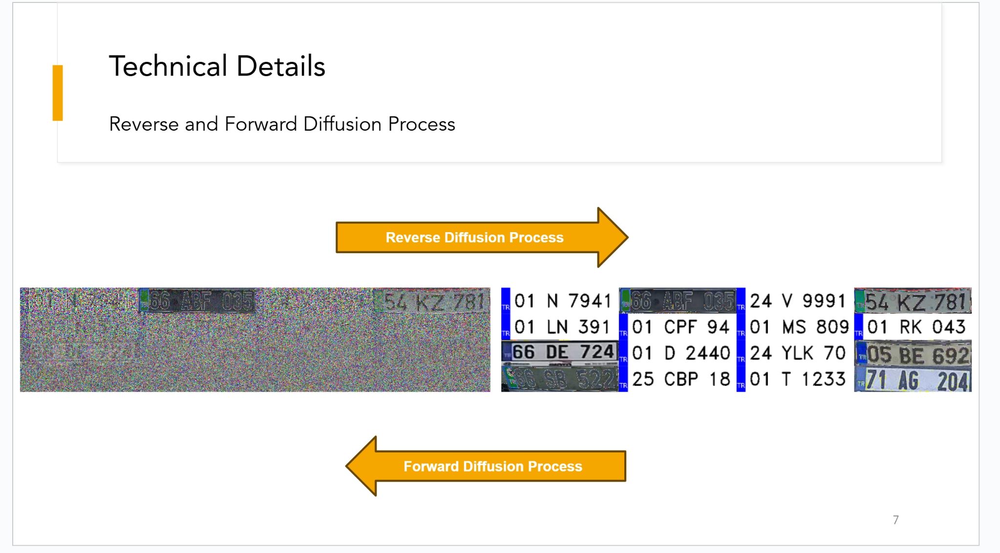
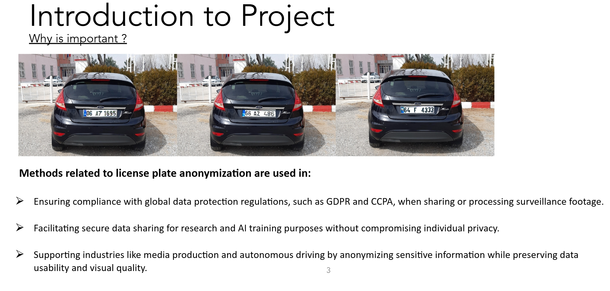
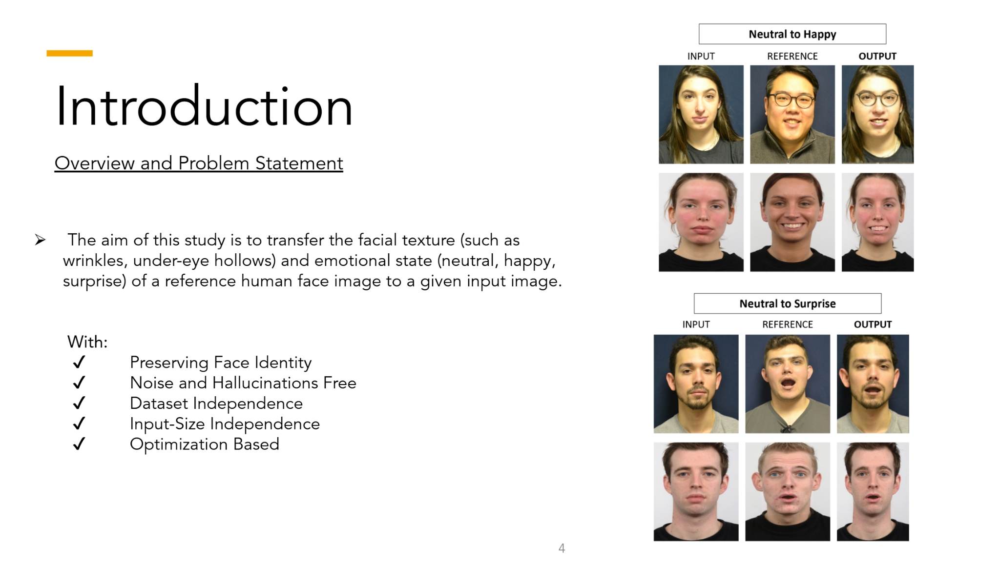
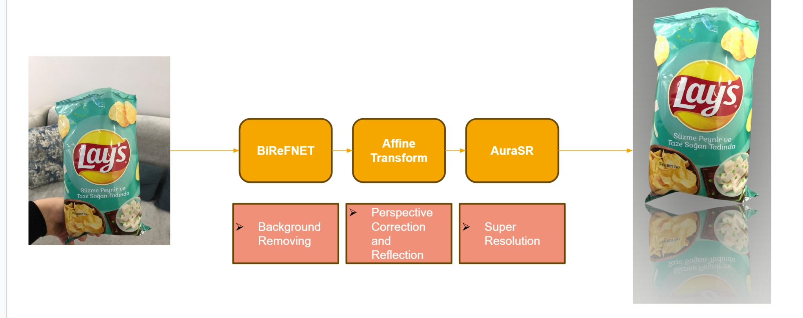
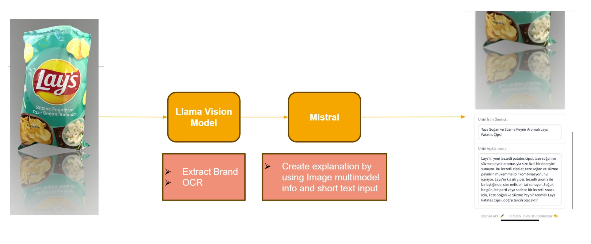

# Generative AI & Computer Vision Portfolio

This repository showcases projects that explore the intersection of generative AI and computer vision. The work spans privacy-focused applications, academic research, and innovative solutions for the e-commerce industry.

---

## License Plate Anonymization using DDPM

 

- **Overview:**  
  Developed a custom license plate anonymization system using a Denoising Diffusion Probabilistic Model (DDPM) trained from scratch. This system automatically detects and anonymizes license plates in images, ensuring privacy while preserving the overall visual context.

- **Key Highlights:**  
  - Utilizes the power of diffusion models for progressive denoising.  
  - Maintains image quality while effectively obscuring sensitive information.

- **Visual Example:**  
 
 

---

## Novel Method in Master Thesis

- **Overview:**  
  As part of my master thesis, I developed a novel and unique method that pushes the boundaries of traditional computer vision techniques. This research introduces innovative approaches to integrating generative models into vision tasks, leading to enhanced performance and new insights.

- **Key Highlights:**  
  - Presents a fresh perspective on solving complex computer vision challenges.  
  - Demonstrates significant improvements over conventional methods.

- **Visual Overview:**  
  

---

## Retail Product Photo & Text Generation for E-Commerce

- **Overview:**  
  Created an end-to-end pipeline that transforms natural product images into studio-quality visuals while generating rich, realistic textual descriptions. This project is tailored for commerce websites, aiming to improve product presentation and customer engagement.

- **Key Highlights:**  
  - Converts everyday product images into high-quality, appealing shots.  
  - Automatically generates detailed product descriptions to enhance online listings.

- **Visual Example:**  
  
  

---

